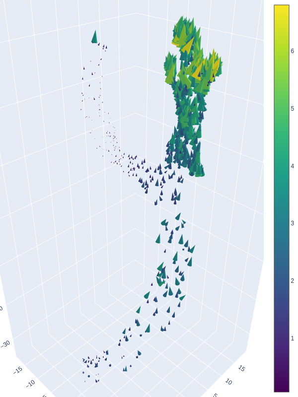

# Experiments

In this Git repository, you can find the implementation of the experiments conducted for my Master's thesis.

## Abstract

This thesis investigates the applicability of various neural network architectures for predicting blood flow in the carotid artery with stenoses, using point clouds as input data. Six architectures of varying complexity, including SC-LMLP, SC-LE, SS-LAE, LS-LAE, PointNet, and PointNet++, were evaluated with differently transformed input data. Transformations such as unit cube scaling, zero centering, grid interpolation, and domain-specific feature augmentation (Relative Inputs) were analyzed. Results show that both the network architecture and point cloud preprocessing significantly affect prediction accuracy. Simple architectures like SC-LMLP benefited from domain-specific features, while complex architectures like LS-LAE and PointNet++ demonstrated greater robustness and generalizability. The Relative Input transformation achieved the best results but is computationally intensive. Despite promising results, the models lack the reliability to accurately predict blood flow parameters for practical medical applications. This thesis provides a comprehensive evaluation of network architectures and highlights key challenges for future research.

## Project Structure

### Data Preprocessing Methods

In ```data/```, you can find all source data from Eulzer et al., partially generated using Python scripts in ```preprocessing_scripts```.

- ```vessel_point_data```
  - Point data for all vessels
  - Starting points for all transformations
- ```vessel_grid64_data```
  - Grid data with a grid size of 64 for all vessels
  - Generated by ```generate_grid_data.py```
- ```vessel_grid128_data```
  - Grid data with a grid size of 128 for all vessels
  - Generated by ```generate_grid_data.py```
- ```vessel_rel_data```
  - Relative point data for all vessels
  - Generated using the Carotid Analyzer by Eulzer et al.
- ```vessel_cond_data```
  - Condition vector for all vessels
- ```geom_point_data```
  - Point data for all additional geometries
  - Starting points for all transformations
- ```geom_grid64_data```
  - Grid data with a grid size of 64 for all additional geometries
  - Generated by ```generate_grid_data.py```
- ```geom_grid128_data```
  - Grid data with a grid size of 128 for all additional geometries
  - Generated by ```generate_grid_data.py```
- ```geom_rel_data```
  - Relative point data for all additional geometries
  - Generated using the Carotid Analyzer by Eulzer et al.
- ```geom_cond_data```
  - Condition vector for all additional geometries

The following preprocessing transformations were applied:

- Unit Cube
- Zero Center
- Rotation (Data Augmentation)
- Grid64
- Grid128
- Relative Inputs

Unit Cube and Zero Center transformations were calculated using the ```transform_function``` in ```utils/helper_function.py```. The grid transformations and Relative Inputs were already in the correct form during data generation.

```python
transform_function_mapping = {
    'unitcube': transform_unit_cube,
    'zerocenter': transform_zero_center,
    'grid64': transform_linear,
    'grid128': transform_linear,
    'rel': transform_linear
}
````

## Results

Im folgendenden sind die Plots besten Ergebnisse jeder Architektur und Preprocessing Transformation aufgelistet.

<details><summary>SC-LMLP + Unit Cube</summary>


</details>

<details><summary>SC-LMLP + Zero Center</summary>


</details>

<details><summary>SC-LMLP + Grid Interpolation</summary>


</details>

<details><summary>SC-LMLP + Relative Inputs</summary>


</details>

<details><summary>SC-LE + Unit Cube</summary>


</details>

<details><summary>SC-LE + Zero Center</summary>


</details>

<details><summary>SC-LE + Grid Interpolation</summary>


</details>

<details><summary>SC-LE + Relative Inputs</summary>


</details>

<details><summary>SS-LAE + Unit Cube</summary>


</details>

<details><summary>SS-LAE + Zero Center</summary>



</details>

<details><summary>SS-LAE + Grid Interpolation</summary>


</details>

<details><summary>SS-LAE + Relative Inputs</summary>


</details>

<details><summary>LS-LAE + Unit Cube</summary>


</details>

<details><summary>LS-LAE + Zero Center</summary>


</details>

<details><summary>LS-LAE + Grid Interpolation</summary>


</details>

<details><summary>LS-LAE + Relative Inputs</summary>


</details>

<details><summary>PointNet + Unit Cube</summary>


</details>

<details><summary>PointNet + Zero Center</summary>


</details>

<details><summary>PointNet + Grid Interpolation</summary>


</details>

<details><summary>PointNet + Relative Inputs</summary>


</details>

<details><summary>PointNet++ + Unit Cube</summary>


</details>

<details><summary>PointNet++ + Zero Center</summary>


</details>

<details><summary>PointNet++ + Grid Interpolation</summary>


</details>

<details><summary>PointNet++ + Relative Inputs</summary>


</details>